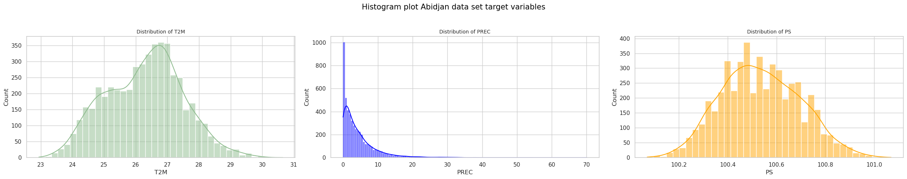
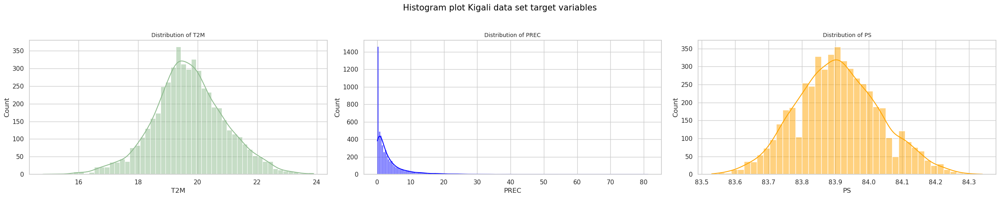

<!-- ---
jupyter:
  jupytext:
    cell_metadata_filter: -all
    custom_cell_magics: kql
    main_language: python
    text_representation:
      extension: .md
      format_name: markdown
      format_version: '1.3'
      jupytext_version: 1.11.2
--- -->

<!-- ## Localized Weather Prediction Using Kolmogorov-Arnold Networks and Deep RNNs -->

# Localized Weather Prediction  Using Kolmogorov-Arnold Network-Based Models and Deep RNNs

## Description 📝 
This repository contains the code for our paper [Localized Weather Prediction  Using Kolmogorov-Arnold Network-Based Models and Deep RNNs](https://arxiv.org/abs/2505.22686).
Our  research investigates the efficacy of novel Kolmogorov-Arnold Network (KAN) based architectures alongside traditional Deep Recurrent Neural Networks (RNNs) for weather prediction in specific geographical locations. The primary goal is to assess which model paradigm offers superior performance and interpretability for localized weather forecasting tasks. We explore various configurations, including different activation functions within Temporal KAN (TKAN) variants, and conduct a comprehensive comparative analysis.

## Key Features & Contributions ✨ 
1. Comparative Analysis: A rigorous comparison of KAN, various TKAN architectures (including Simple TKAN with SiLU, Mish, and GELU activations), and traditional Deep RNNs (LSTM, BiLSTM, GRU, BiGRU, Ensemble Model) for localized temperature prediction.
2. Demonstrated KAN Superiority: Our findings overwhelmingly show that the KAN model significantly outperforms all other evaluated models in terms of predictive accuracy and data fit for temperature .
3. TKAN Variant Evaluation: Investigation into the impact of different activation functions (SiLU, Mish, GELU) within simplified TKAN architectures, revealing subtle performance differences and general improvements over standard TKAN.
4. Localized Prediction Focus: Application and evaluation of these models on real-world localized weather datasets (Abidjan and Kigali).

## Dataset📊
The models were trained and evaluated on precipitation, 2-meter temperature data and pression from two distinct locations: Abidjan, Côte d'Ivoire and Kigali, Rwanda. The data sets used in this study can be found in the **data** folder.
<!-- 
 -->
<table>
  <thead>
    <tr>
      <th style="text-align: center;">Abidjan</th>
      <th style="text-align: center;">Kigali</th>
    </tr>
  </thead>
  <tbody>
    <tr>
      <td style="text-align: center;">
        
        <em>Abidjan Temperature, Precipitation and  Pressure Distribution</em>
      </td>
      <td style="text-align: center;">
        
        <em>Kigali Temperature, Precipitation and  Pressure Distribution</em>
      </td>
    </tr>
    <tr>
      <td style="text-align: center;">
        
        <em>Abidjan Location Map</em>
      </td>
      <td style="text-align: center;">
        
        <em>Kigali Location Map</em>
      </td>
    </tr>
  </tbody>
</table>

## Cite this paper
 <pre> 
@misc{akazan2025localizedweatherpredictionusing,
      title={Localized Weather Prediction Using Kolmogorov-Arnold Network-Based Models and Deep RNNs}, 
      author={Ange-Clement Akazan and Verlon Roel Mbingui and Gnankan Landry Regis N'guessan and Issa Karambal},
      year={2025},
      eprint={2505.22686},
      archivePrefix={arXiv},
      primaryClass={cs.LG},
      url={https://arxiv.org/abs/2505.22686}, 
}
 </pre> 

